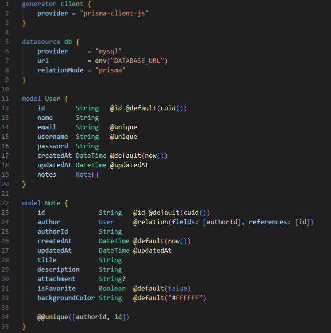

# BackEnd

## Dependências
- [Koa](https://koajs.com/)
- [Prisma](https://www.prisma.io/)
- [BCrypt](https://www.npmjs.com/package/bcrypt)
- [CUID](https://www.npmjs.com/package/cuid)
- [DotEnv](https://www.npmjs.com/package/dotenv)
- [JsonWebToken](https://www.npmjs.com/package/jsonwebtoken)
- [Koa-BodyParser](https://www.npmjs.com/package/koa-bodyparser)
- [Semver](https://www.npmjs.com/package/semver)

## Sobre 

O projeto consiste em uma API de lista de tarefas para uso Online.

API construída com o framework [KoaJS](https://koajs.com/) utilizando o [Prisma](https://www.prisma.io/) como ORM e [PlanetScale](https://planetscale.com/) como database MySQL.

O projeto serviu principalmente para reforçar meu entendimento sobre Schemas.\
O desafio principal foi criar um schema para este projeto lendo a documentação e entendendo as relações entre tabelas.

## Routes
    router.get("/login", user.login);
    router.post("/user", user.createUser);
    router.delete("/user", user.deleteUser);

    router.get("/allnotes", note.getAllNotes);
    router.get("/notes", note.getNotesFromAuthor);
    router.patch("/note", note.patchNote);
    router.delete("/note", note.deleteNote);

    router.get("/:authorid", note.getNotesFromAuthor);

## Database

## Start Project in Mode Develop:
1. `npm i`
2. `npm run dev`

Link padrão: [API](http://localhost:4000/) http://localhost:4000/

---
obs. arquivo `.env`  exportado somente para fins avaliativos.