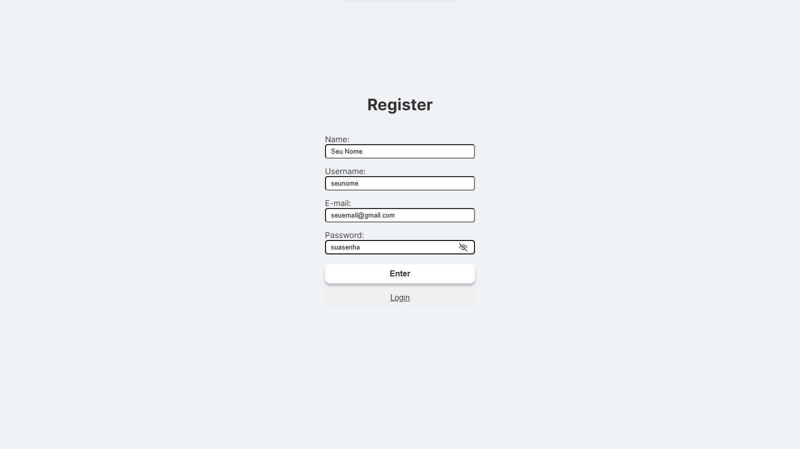
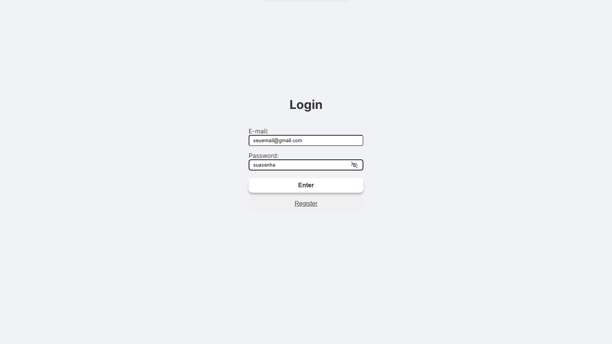
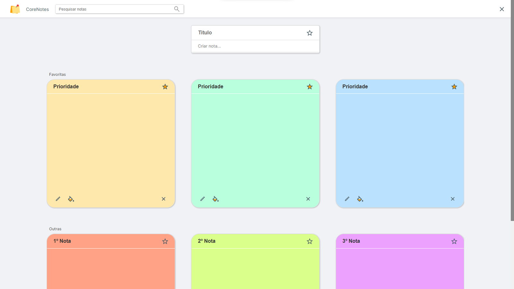

# CoreNotes Full Stack Challenge

Aplicativo da Web de criação e gerenciamento de suas listas de tarefas. 

## Features
- CRUD
    - Criação de tarefas com título, descrição e marcação de favoritos.
    - Leitura/visualização de todas as tarefas criadas.
    - Modificações como título, descrição, marcação como favorito e cor de tarefas previamente criadas.
    - Deletar tarefas.
- Dynamic Search
    - Pesquisa de tarefas por título e descrição.
    - Pesquisa feita através de sequência de caracteres compatíveis.
    - Ex. Pesquisa: abc, Tarefa1: 123abc (Aparece), Tarefa2: a1b2c3 (Não aparece)
- Favorites System
    - Marque uma tarefa como favorita para aparecer no topo.
    - Desmaque uma tarefa da lista de favotitas para ser uma tarefa comum.
- Multiple Colors
    - Mude a cor da sua tarefa.
    - 12 cores disponíveis.
- Online _(em Ambiente de Produção com Database na Nuvem)_
    - Isso mesmo, compartilhe seu link para qualquer pessoa acompanhar suas tarefas.
    - Não se preocupe, apenas quem tiver o login do autor pode modificar as tarefas compartilhadas.
    - Link com chave aleatória para que somente você possa compartilhar.
- Responsive
    - MobileFirst: Largura miníma de 400px.
    - Adaptável para laptops e grandes telas.

## Preview
- Home: /

- Register: /register

- Login: /login

- Admin Dashboard: /authorid

- Visitor Dashboard: /authorid

---

## Download Project
`git clone https://github.com/DiegoVitorGomesDias/corelab-web-challenge.git`

## FrontEnd
Repository: [FrontEnd](./frontend/)

### Start Project in Mode Develop:
1. `cd .\frontend\`
2. `npm i`
3. `npm run dev`

Link padrão: [WebPage](http://localhost:3000/) http://localhost:3000/

Mais detalhes: [Readme](frontend/README.md)

## BackEnd
Repository: [FrontEnd](./frontend/)

### Start Project in Mode Develop:
1. `cd .\backend\`
2. `npm i`
3. `npm run dev`

Link padrão: [API](http://localhost:4000/) http://localhost:4000/

Mais detalhes: [Readme](backend/README.MD)

---
obs. arquivo `.env`  exportado somente para fins avaliativos.

# Author
👋 Olá mundo. Meu nome é @DiegoVitorGomesDias e tenho 18 anos.\
👀 Tenho interesse em Desenvolvimento Frontend e Web Design\
📚 Eterno aprendiz e buscador de conhecimento.\
🧮 Inteligência Lógica-Matemática, Intrapessoal e Existencial.\
✨ Apaixonado por ciência, tecnologia, matemática, vôlei, astronomia e música.\
📖 Conhecimentos notáveis em informática, pacote Office, pacote Adobe, programação, entre outros.\
🗣️ Instrutor na Associação de Polícia Mirim de Manhuaçu, lecionando sobre Hierarquia e Disciplina, Ética e Moral, Chefia e Liderança.

### 🔗Links:
[Linkedin](https://www.linkedin.com/in/diegovitorgomesdias/): @diegovitorgomesdias\
[GitHub](https://github.com/DiegoVitorGomesDias): @DiegoVitorGomesDias

### 🌐 Redes Sociais
[Twitter](https://twitter.com/DiegoVitorGDias): @DiegoVitorGDias\
[Instagram](https://www.instagram.com/diegovitorgomesdias/): @diegovitorgomesdias\
[Instagram Design Gráfico](https://www.instagram.com/dg.productionsgraphics/): @dg.productionsgraphics